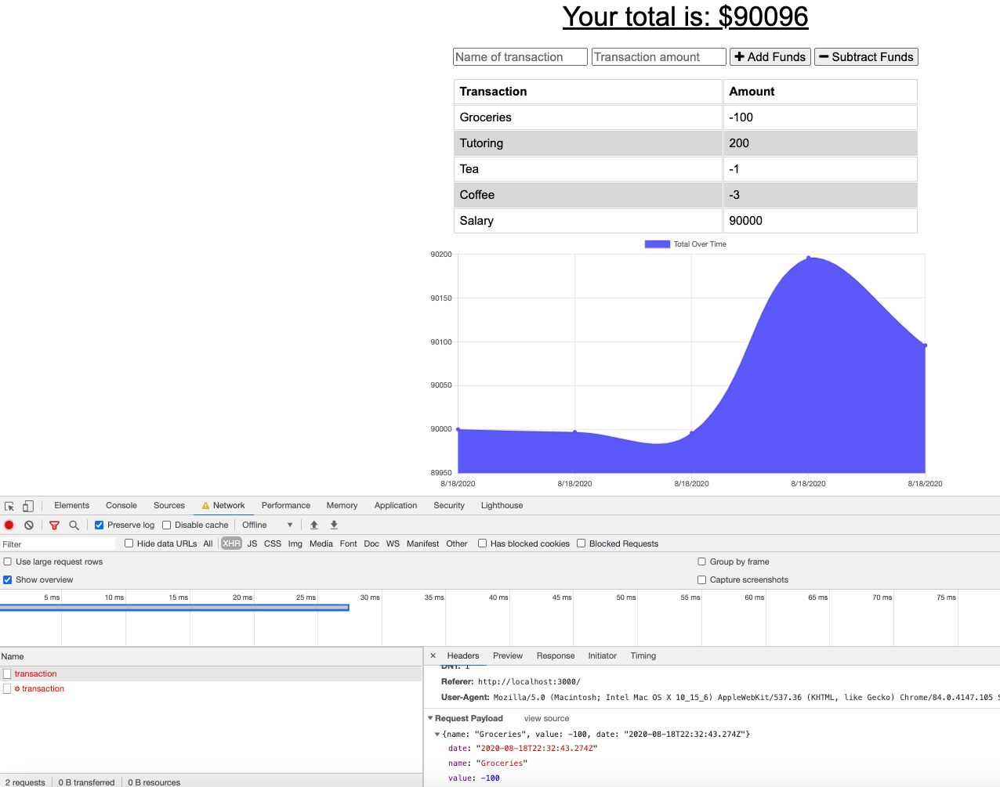
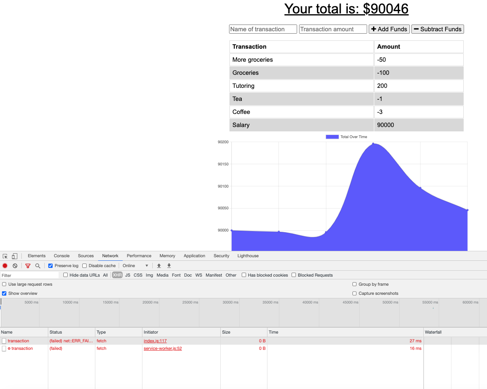

# Budget tracker application with online/offline access

[Live website on Heroku]()
[GitHub repo]()

## Description

This application allows a user to add expenses and deposits to their budget with or without internet connection. When entering transactions offline, transactions are added to the total history when the connection is back online.

Offline Functionality:

- Enter deposits offline
- Enter expenses offline

When brought back online:

- Offline entries are added to tracker.

The application uses Mongo database with a Mongoose schema and handles routes with Express.

## Table of contents

[User Story](#user-story)

[Business Context](#business-context)

[Images](#images)

[Installation](#installation)

[Tech](#techStack)

[License](#license)

[Questions](#questions)

## User Story

AS AN avid traveller
I WANT to be able to track my withdrawals and deposits with or without a data/internet connection
SO THAT my account balance is accurate when I am traveling

## Business Context

Giving users a fast and easy way to track their money is important, but allowing them to access that information anytime is even more important. Having offline functionality is paramount to our applications success.

## Images

Offline:

Online:

## Installation and usage

No installation. Just open the [Live website on Heroku]().
In order to look at/play with the underlying code, clone the code on your machine, install and import dependencies with `npm install`. Run the application with a command `node server.js` in a terminal. MongoDB needs to be installed on your machine as well.

## Tech Stack

[Mongoose](https://www.npmjs.com/package/mongoose) framework used in a Node.js with a [MongoDB](https://www.mongodb.com/) database for modeling objects.

Express web framework for node [Express](https://www.npmjs.com/package/express) to provide small, robust tooling for HTTP servers, making it a great solution for single page applications, web sites, hybrids, or public HTTP APIs.

Extension for VS code [Prettier - Code formatter](https://marketplace.visualstudio.com/items?itemName=esbenp.prettier-vscode) to autoformat the code when saving.

Instructor and TAs for the help with deployment to Heroku.

## License

MIT license.

## Questions

If you any additional questions you can reach me via my [Github user profile](https://www.github.com/szaster) or [write me directly](mailto:szaster@protonmail.com).

You also can [file an issue]() if you find a bug.
